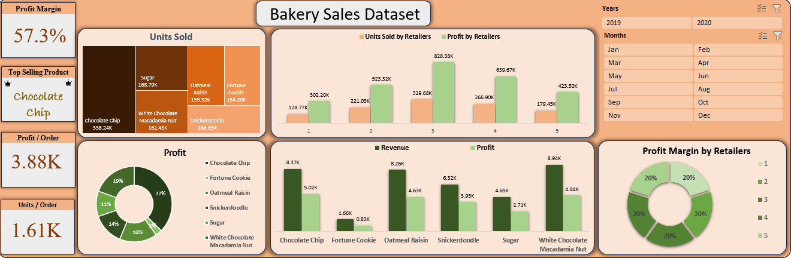

# 🍪 Wholesaler Cookies Sales Dataset

Analyze wholesale cookie sales transactions and transform them into actionable business insights, helping management evaluate sales performance, profitability, customer behavior, and product demand for strategic decision-making and business growth.

## 📌 Table of Contents

- <a href="#overview">Overview</a>
- <a href="#problem-statement">Problem Statement</a>
- <a href="#dataset">Dataset</a>
- <a href="#tools--technologies">Tools & Technology</a>
- <a href="#data-cleaning--preparation">Data Cleaning & Preparation</a>
- <a href="#exploratory-data-analysis-eda">Exploratory Data Analysis (EDA)</a>
- <a href="#research-question--key--findings">Research & Key Finding</a>
- <a href="#dashboard">Dashboard</a>
- <a href="#result-&-conclusion">Results & Conclusion</a>
- <a href="#future-work">Future Work</a>

---

<h2>Overview</h2>

This project analyzes wholesale cookie sales data to evaluate product performance, retailer contributions, revenue generation, profitability, and sales trends. The dataset contains order-level information including products, units sold, revenue, cost, profit margin, and retailer details.

---

<h2>Problem Statement</h2>

The wholesale cookie business needs to identify its most profitable products and retailers while understanding overall sales performance. Without proper analysis, it becomes difficult to optimize inventory, improve profitability, and focus on high-performing products and sales channels.

---

<h2>Dataset</h2>

CSV file located in `/Data/` folder (RawData)

---

<h2>Tools & Technology</h2>

### Tools
1. **Excel**: Functions, Pivot Charts, Interactive Dashboards
2. **SQL**: Common Table Expression, Joins, Filtering
3. **Git**: Project Upload

---

<h2>Data Cleaning & Preparation</h2>
  
### Data Quality
- Remove Blank Rows
- Remove duplicate Rows

---

<h2>Exploratory Data Analysis (EDA)</h2>

### Outliers Identified
- Unit Sold 4.22K 
- Revenue 19.67K
- Cost Price 7.97K
- Gross Profit 11.45K
  
---

<h2>Research & Key Finding</h2>

### Research Question
* Which cookie products generate the highest revenue?
* Which retailers contribute the most to sales?
* What is the overall profitability of the business?
* Which products are sold most frequently?
* How many units were sold overall?

### Key Findings
* Chocolate Chip Cookies generated the highest revenue.
* Retailer ID 3 generated the highest revenue and profit.
* Total Revenue: $4.69 Million
* Chocolate Chip Cookies recorded the highest number of orders.
* More than 1.12 Million units of cookies were sold during the analyzed period.

---

<h2>Dashboard</h2>

### Excel dashboard visualize:
   * Retailer Wise Sales & Profit
   * Product Performance
   * Monthly Inventory

<h2>Results & Conclusion</h2>

The analysis reveals that the wholesale cookie business is highly profitable, generating approximately $2.72 million in profit from $4.69 million in revenue. Chocolate Chip Cookies are the primary revenue driver and should remain a strategic focus. Retailers 3 and 4 contribute the largest share of sales and profits, making them key business partners. Overall, the company demonstrates strong market demand and sustainable profitability.

---

<h2>Future Work</h2>

##### Several enhancements can further increase the business value of this analysis:
* Predictive Sales Forecasting
* Customer Segmentation
* Inventory Optimization
* Profitability Dashboard
* Seasonal Demand Analysis

---
